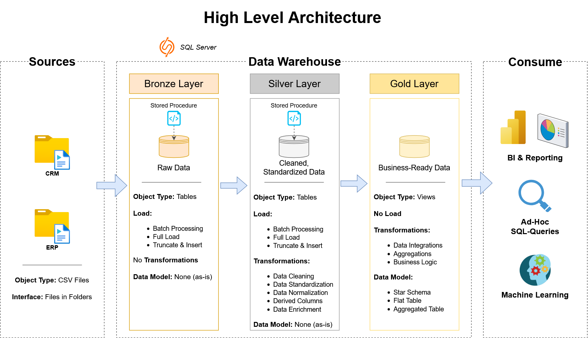

# Data Engineering Warehouse Project
This portfolio project showcases a modern approach to data warehousing and analytics using SQL Server. It covers key components such as ETL processes, data modeling, and analytics, while reflecting industry-standard practices in modern data engineering.

## Project Overview

This project involves:

1. **Data Architecture**: Designing a Modern Data Warehouse Using the Medallion Architecture: **Bronze**, **Silver**, and **Gold** Layers.
2. **ETL Pipelines**: Extracting, Transforming, and Loading data from source systems into the warehouse.
3. **Data Modeling (Kimball)**: Developing fact and dimension tables optimized for analytical queries.

## Data Architecture
The data architecture for this project is the Medallion (Multi-Hop) Architecture. This architecture consists of three distinct layers that perform ETL on the data.



### Bronze Layer
In the Bronze Layer the data is Extracted from the source system (the CRM and ERP). The data is not Transformed in the Bronze Layer and is Loaded to the 'bronze' schema using a Full Load.

### Silver Layer
The Silver Layer Transforms the data from the Bronze Layer to clean data, and then it is Loaded into the 'silver' schema using a Full Load. The following Transformations are applied:
- Data Cleaning: string trimming and replacing NULL values
- Data Standardization: making values consistent
- Data Normalization: replacing special characters
- Derived Columns: calculating the cost
- Data Enrichment: adding additional data from other tables (e.g., customer's birth dates and countries)

### Gold Layer
The Gold Layer integrates and aggregates data to create business-ready information. It is modeled using a star schema to optimize analytics and facilitate informed decision-making.

## Links & Tools:

- **[Datasets](datasets/):** The data used for this project (csv files).
- **[Data with Baraa](https://www.youtube.com/@DataWithBaraa):** Helpful information for learning about SQL, ETL and data warehouses.
- **[SQL Server](https://www.microsoft.com/en-us/sql-server/sql-server-downloads):** Lightweight server for hosting the SQL database.
- **[mssql VSCode extension](https://marketplace.visualstudio.com/items?itemName=ms-mssql.mssql):** VSCode extension for managing and interacting with the database.
- **[Git](https://github.com/):** For managing the code and project details.
- **[DrawIO](https://www.drawio.com/):** Tool to design data architecture, models, flows, and diagrams.
- **[Notion](https://www.notion.com/):** All-in-one tool for project management and planning.

Repository Structure
```
data-engineering-warehouse-project/
│
├── datasets/                           # Raw datasets used for the project (ERP and CRM data)
│
├── docs/                               # Project documentation and architecture details
│   ├── data_architecture.drawio.png    # Shows the project's architecture
│   ├── data_catalog.md                 # Catalog of datasets, including field descriptions and metadata
│   ├── data_flow.drawio.png            # Shows the data flow diagram
│   ├── data_models.drawio.png          # Shows the data model (star schema)
│   └── naming-conventions.md           # Consistent naming guidelines for tables, columns, and files
│
├── scripts/                            # SQL scripts for ETL and transformations
│   ├── bronze/                         # Scripts for extracting and loading raw data
│   ├── silver/                         # Scripts for cleaning and transforming data
│   └── gold/                           # Scripts for creating analytical models
│
├── tests/                              # Scripts for validating the quality of the scripts
│
├── README.md                           # Project overview and information
└── LICENSE                             # License information for the repository
```
